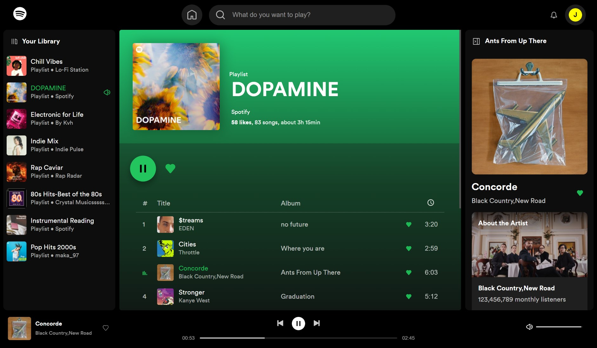

# SpotifyLite - Angular 19 web-app Music Player 🎵

This project was generated using [Angular CLI](https://github.com/angular/angular-cli) version 19.0.6.

A lightweight music streaming web app built using **Angular 19**.  
This project includes essential Spotify-like functionality with a clean and responsive interface.

## 🔎 Live Demo 
  [View live project on Netlify](https://spotify-litee.netlify.app)

## Main Features

- **Play / Pause / Next / Previous**
- **Volume Control**
- **Audio streaming** with real-time player state
- **Resizable sidebars (asides)** — both left and right panels are draggable and adjustable
- Custom directive to auto-scroll overflowing text
- Skeleton loaders during async data fetch
- ** Full Responsive Design**
- Built with **Standalone Components** and **Angular Signals**

## 📸 Screenshots

### Desktop View

  

###  Mobile View

  
  
  
   

## ⚒ Tech Stack

- **Angular 19**
- **Angular Material** – for UI components like sliders, buttons, layouts
- **Angular CDK** – for custom floating panels
- **RxJS** – for reactive streams and data fetching
- **Angular Signals** – for reactive state management 
- **HTML5 `<audio>` API** – for native audio playback
- **SCSS/CSS Modules**
- **Netlify** – for deployment

## What I Learned

- How to use **Angular Signals** for fine-grained reactive UI updates
- Managing native audio playback via services and event streams
- Responsive layouts with: **Angular Material** components, container querys, custom properties with @property
- Building overlays with **CDK Overlay** instead of third-party modals
- Implementing resizable sidebars in a component-based structure

##  Disclaimer

This project is for **educational purposes only** and is not affiliated with Spotify.

